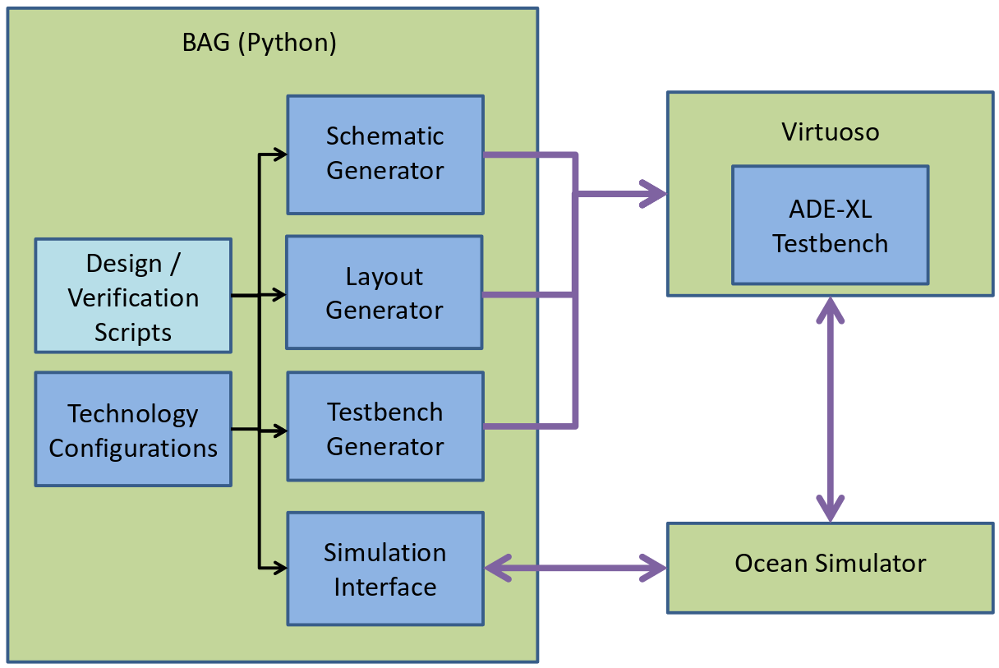

Overview
========

    BAG design flow diagram

BAG is a Python-based circuit design platform that aims to automate analog circuit design, but at the same time give the
user full visibility and control over every step in the design flow.

The analog circuit design flow is generally as follows:

#. Create a schematic generator of the circuit.
#. Create a testbench generator to measure specifications and verify functionality.
#. Create a layout generator if post-extraction verification is needed.
#. Generate a schematic  with given specifications.
#. Generate a testbench that instantiates the generated schematic.
#. Simulate the testbenches and post-process data to verify that the circuit meets specifications.
#. Create the layout of your schematic and verify it's LVS/DRC clean.
#. Repeat step 3 on post-extraction schematic.

BAG 2.0 is designed so that any or all steps of the design flow can be performed in a Python script or console, thus
enabling rapid design iteration and architecture exploration.

To achieve its goal, BAG is divided into 4 components:  schematic generators, layout generators, design modules, and
testbench generators. These components are independent from one another, so the designer can pick and choose which steps
in the design flow to automate.  For example, the designer can simply use BAG to generate new schematics, and use his
own CAD program for simulation and verification.  Alternatively, The designer can provide an existing schematic to BAG
and simply use it to automate the verification process.

BAG interacts with an external CAD program or simulator to complete all the design and simulation tasks.  BAG comes with
Virtuoso and Ocean simulator support, but can be extended to other CAD programs or simulators.  The rest of this
document assumes you are using Virtuoso and running simulations in Ocean.

Next we will describe each components of BAG in detail.

.. toctree::
    :maxdepth: 2

    schematic
    design
    testbench